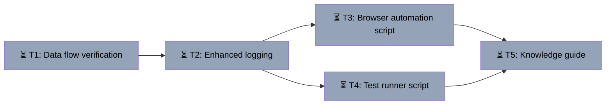

# Chat Flow Testing & Documentation System
Branch: main | Level: 2 | Type: implement | Status: in_progress
Started: 2026-03-12T14:55:00Z

## DAG


## Tree
```
⏳ T1: Data flow verification [routine]
└──→ ⏳ T2: Enhanced logging [routine]
     ├──→ ⏳ T3: Browser automation script [careful]
     │    └──→ ⏳ T5: Knowledge guide [routine]
     └──→ ⏳ T4: Test runner script [routine]
          └──→ ⏳ T5: Knowledge guide [routine]
```

## Tasks

### T1: Data flow verification [implement] [routine]
- Scope: .browser/
- Verify: `cat .browser/data-flow-analysis.md | grep -c "Message shape"`
- Needs: none
- Status: pending ⏳
- Description: Use agent-browser to trace actual message flow from /chat/new → select lab → send message → receive response. Capture network requests, console logs, and data shapes at each step. Write findings to .browser/data-flow-analysis.md

### T2: Enhanced logging [implement] [routine]
- Scope: app/api/copilotkit/route.ts, agent/graphs/course_builder.py, components/teacher/CourseBuilder.tsx
- Verify: `grep -r "\[DATA-FLOW\]" app/ agent/ components/ | wc -l`
- Needs: T1
- Status: pending ⏳
- Description: Add [DATA-FLOW] type-shape logs at key points: frontend message send, API bridge, backend agent receive, backend agent response, frontend message receive. Log structure only, not full payloads.

### T3: Browser automation script [implement] [careful]
- Scope: .browser/test-chat-flow.js
- Verify: `node .browser/test-chat-flow.js --dry-run 2>&1 | tail -5`
- Needs: T2
- Status: pending ⏳
- Description: Create Playwright script that: logs in with test credentials, navigates to /chat/new, selects lab type, sends test message, waits for response, captures all console logs. Save to .browser/test-chat-flow.js

### T4: Test runner script [implement] [routine]
- Scope: .browser/run-test.sh
- Verify: `bash .browser/run-test.sh --help 2>&1 | grep -c "Usage"`
- Needs: T2
- Status: pending ⏳
- Description: Create bash script that: starts frontend/backend if needed, runs browser test, captures browser console + backend logs, saves timestamped output to .browser/logs/, generates summary report. Make executable.

### T5: Knowledge guide [implement] [routine]
- Scope: .browser/CHAT_FLOW_GUIDE.md
- Verify: `cat .browser/CHAT_FLOW_GUIDE.md | grep -c "##"`
- Needs: T3, T4
- Status: pending ⏳
- Description: Document complete message pathway with: flow diagram, log correlation guide (how to match frontend logs to backend), common debugging patterns, troubleshooting checklist. Include examples from actual test runs.
