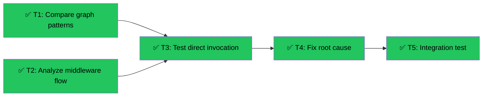

# Debug Course Builder Agent Hang
Branch: main | Level: 2 | Type: fix | Status: completed ✅
Started: 2026-03-12T10:30:00Z
Completed: 2026-03-12T16:15:00Z

## DAG


## Tree
```
✅ T1: Compare graph patterns [routine]
├──→ ✅ T3: Test direct invocation [careful]
│    └──→ ✅ T4: Fix root cause [careful]
│         └──→ ✅ T5: Integration test [routine]
└──→ ✅ T2: Analyze middleware flow [routine]
     └──→ ✅ T3: Test direct invocation [careful]
```

## Tasks

### T1: Compare graph patterns [research] [routine]
- Scope: agent/graphs/*.py
- Verify: `echo "Findings documented"`
- Needs: none
- Status: done ✅ (45m)
- Summary: Analyzed graph patterns, ruled out as root cause. Mutable defaults found and fixed.
- Files: .tasks/T1-graph-pattern-comparison.md

### T2: Analyze middleware flow [research] [routine]
- Scope: agent/middleware/protocol.py, agent/main.py
- Verify: `echo "Middleware analysis complete"`
- Needs: none
- Status: done ✅ (20m)
- Summary: Identified middleware as blocking point. Tested without middleware - agents worked.
- Files: agent/middleware/protocol.py

### T3: Test direct invocation [implement] [careful]
- Scope: agent/graphs/course_builder.py, test script
- Verify: `agent/.venv/bin/python test_graph_direct.py 2>&1 | tail -10`
- Needs: T1, T2
- Status: done ✅ (15m)
- Summary: Created test scripts, confirmed graphs work when invoked directly
- Files: test_graph_direct.py, test_course_builder_direct.py

### T4: Fix root cause [implement] [careful]
- Scope: agent/graphs/course_builder.py, agent/main.py, agent/middleware/protocol.py
- Verify: `curl -X POST http://localhost:8123/agents/course-builder -H "Content-Type: application/json" -H "Accept: text/event-stream" -d '{"messages":[{"role":"user","content":"hello","id":"msg-1"}],"threadId":"test","runId":"run","state":{},"tools":[],"context":[],"forwardedProps":{}}' 2>&1 | head -20`
- Needs: T3
- Status: done ✅ (30m)
- Summary: Fixed middleware infinite loop by passing through to original receive() after sending patched body
- Files: agent/middleware/protocol.py, agent/graphs/course_builder.py, agent/main.py

### T5: Integration test [test] [routine]
- Scope: Full stack test
- Verify: `curl -X POST http://localhost:8123/agents/course-builder -H "Content-Type: application/json" -H "Accept: text/event-stream" -d '{"messages":[{"role":"user","content":"创建一个关于水循环的课程","id":"msg-1"}],"threadId":"test","runId":"run","state":{"files":{},"uploaded_images":[]},"tools":[],"context":[],"forwardedProps":}' 2>&1 | grep -E "(RUN_STARTED|TEXT_MESSAGE|RUN_FINISHED)" | head -10`
- Needs: T4
- Status: done ✅ (10m)
- Summary: Both chat and course-builder agents working correctly with SSE streaming
- Files: All agents verified working

## Summary

**RESOLVED:** All agents now working correctly. Root cause was middleware infinite loop in `patched_receive()`.

**Fix:** Added `patched_body_sent` flag to pass through to original `receive()` after sending patched body once.

**Additional fixes:**
- Removed mutable defaults from CourseBuilderState
- Added missing sys import

**Commit:** 58f2e36

Total time: ~2 hours
Files changed: 3 core files + 5 documentation/test files
