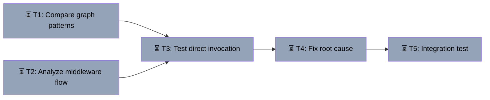

# Debug Course Builder Agent Hang
Branch: main | Level: 2 | Type: fix | Status: in_progress
Started: 2026-03-12T10:30:00Z

## DAG


## Tree
```
⏳ T1: Compare graph patterns [routine]
├──→ ⏳ T3: Test direct invocation [careful]
│    └──→ ⏳ T4: Fix root cause [careful]
│         └──→ ⏳ T5: Integration test [routine]
└──→ ⏳ T2: Analyze middleware flow [routine]
     └──→ ⏳ T3: Test direct invocation [careful]
```

## Tasks

### T1: Compare graph patterns [research] [routine]
- Scope: agent/graphs/*.py
- Verify: `echo "Findings documented"`
- Needs: none
- Status: pending ⏳
- Description: Compare build_course_builder_graph_sync() with build_observation_graph() and build_chat_graph() to identify structural differences

### T2: Analyze middleware flow [research] [routine]
- Scope: agent/middleware/protocol.py, agent/main.py
- Verify: `echo "Middleware analysis complete"`
- Needs: none
- Status: pending ⏳
- Description: Verify middleware correctly processes course-builder requests and doesn't corrupt the payload

### T3: Test direct invocation [implement] [careful]
- Scope: agent/graphs/course_builder.py, test script
- Verify: `agent/.venv/bin/python test_course_builder_direct.py 2>&1 | tail -10`
- Needs: T1, T2
- Status: pending ⏳
- Description: Create test script to invoke course_builder_graph directly (bypass AG-UI wrapper) to isolate whether issue is in graph or wrapper

### T4: Fix root cause [implement] [careful]
- Scope: agent/graphs/course_builder.py, agent/main.py
- Verify: `curl -X POST http://localhost:8123/agents/course-builder -H "Content-Type: application/json" -H "Accept: text/event-stream" -d '{"messages":[{"role":"user","content":"hello","id":"msg-1"}],"threadId":"test","runId":"run","state":{},"tools":[],"context":[],"forwardedProps":{}}' 2>&1 | head -20`
- Needs: T3
- Status: pending ⏳
- Description: Apply fix based on T3 findings (likely async/sync mismatch or missing await)

### T5: Integration test [test] [routine]
- Scope: Full stack test
- Verify: `./startup.sh && sleep 5 && curl -X POST http://localhost:8123/agents/course-builder -H "Content-Type: application/json" -H "Accept: text/event-stream" -d '{"messages":[{"role":"user","content":"创建一个关于水循环的课程","id":"msg-1"}],"threadId":"test","runId":"run","state":{"files":{},"uploaded_images":[]},"tools":[],"context":[],"forwardedProps":{}}' 2>&1 | grep -E "(RUN_STARTED|TEXT_MESSAGE|RUN_FINISHED)" | head -10`
- Needs: T4
- Status: pending ⏳
- Description: Full end-to-end test with frontend and backend running

## Summary
Debugging why course-builder agent SSE stream starts but chat_node never executes. Working agents (observation, chat) use identical registration pattern, so issue is likely in graph initialization or async compatibility.
