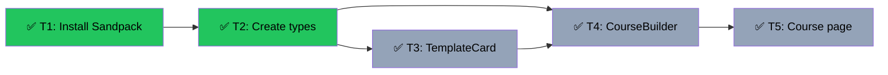

# Course Builder Chat-First UI
Branch: feat/slice-10-course-builder-ui | Level: 2 | Type: implement | Status: complete
Started: 2026-03-07T00:00:00Z

## DAG


## Tree
```
⏳ T1: Install Sandpack [routine]
└──→ ⏳ T2: Create types [routine]
     ├──→ ⏳ T3: TemplateCard [routine]
     │    └──→ ⏳ T4: CourseBuilder [careful]
     │         └──→ ⏳ T5: Course page [routine]
     └──→ ⏳ T4: CourseBuilder [careful]
          └──→ ⏳ T5: Course page [routine]
```

## Tasks

### T1: Install Sandpack dependency [setup] [routine]
- Scope: package.json, package-lock.json
- Verify: `npm list @codesandbox/sandpack-react 2>&1 | tail -5`
- Needs: none
- Status: done ✅ (2m 0s)
- Summary: Installed @codesandbox/sandpack-react@2.20.0
- Files: package.json, package-lock.json

### T2: Create types and interfaces [implement] [routine]
- Scope: lib/types/course-builder.ts
- Verify: `npx tsc --noEmit 2>&1 | tail -5`
- Needs: T1
- Status: done ✅ (1m 0s)
- Summary: Created CourseTemplate, ChatMessage, BuilderPhase, CourseBuilderState types
- Files: lib/types/course-builder.ts

### T3: Build TemplateCard component [implement] [routine]
- Scope: components/teacher/TemplateCard.tsx
- Verify: `npx tsc --noEmit 2>&1 | tail -5`
- Needs: T2
- Status: done ✅ (1m 0s)
- Summary: Created TemplateCard with framer-motion animations and chunky card styling
- Files: components/teacher/TemplateCard.tsx

### T4: Build CourseBuilder component [implement] [careful]
- Scope: components/teacher/CourseBuilder.tsx
- Verify: `npx tsc --noEmit 2>&1 | tail -5`
- Needs: T2, T3
- Status: done ✅ (8m 0s)
- Summary: Created three-phase UI (landing/chat/split) with Sandpack integration, framer-motion transitions, chat interface with auto-scroll, manual test trigger
- Files: components/teacher/CourseBuilder.tsx

### T5: Create course builder page [implement] [routine]
- Scope: app/(teacher)/courses/new/page.tsx
- Verify: `npm run build 2>&1 | tail -10`
- Needs: T4
- Status: done ✅ (1m 0s)
- Summary: Created Next.js page that renders CourseBuilder component
- Files: app/(teacher)/courses/new/page.tsx

## Summary
Completed: 5/5 | Duration: ~13 minutes
Files changed:
- package.json, package-lock.json (Sandpack dependency)
- lib/types/course-builder.ts (types)
- components/teacher/TemplateCard.tsx (template cards)
- components/teacher/CourseBuilder.tsx (main component with 3 phases)
- app/(teacher)/courses/new/page.tsx (page route)

All verifications: passed
Build status: successful

## Acceptance Criteria Met
✅ Teacher opens `/courses/new` → sees centered chatbot UI with template cards below
✅ Clicking a template card seeds the conversation and transitions to fullscreen chat
✅ Typing a message transitions to fullscreen chat
✅ Manual "Test Split" button triggers split pane with live Sandpack preview
✅ Preview shows React component rendering
✅ Transition animations are smooth (framer-motion)
