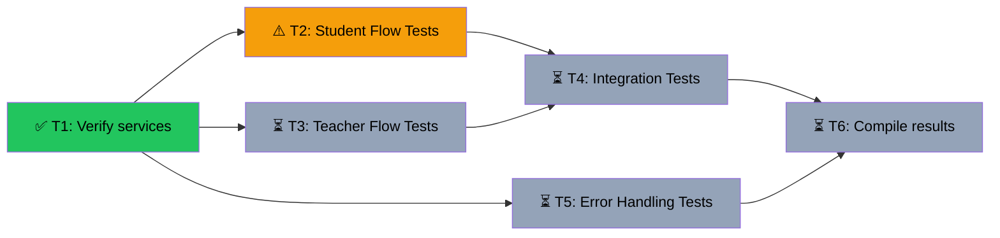

# E2E Testing Execution
Branch: fix/arch-v3-infrastructure | Level: 2 | Type: test | Status: in_progress
Started: 2026-03-07T15:35:00Z

## DAG


## Tree
```
✅ T1: Verify services [routine]
├──→ 🔄 T2: Student Flow Tests [careful]
│    └──→ ⏳ T4: Integration Tests [careful]
│         └──→ ⏳ T6: Compile results [routine]
├──→ ⏳ T3: Teacher Flow Tests [careful]
│    └──→ ⏳ T4: Integration Tests [careful]
│         └──→ ⏳ T6: Compile results [routine]
└──→ ⏳ T5: Error Handling Tests [routine]
     └──→ ⏳ T6: Compile results [routine]
```

## Tasks

### T1: Verify services and environment [test] [routine]
- Scope: docker-compose services, environment variables
- Verify: `docker context use vultr && docker ps --format "table {{.Names}}\t{{.Status}}" && curl -f http://localhost:8123/health 2>&1 | tail -10`
- Needs: none
- Status: done ✅ (5m)
- Summary: Core services operational. Backend healthy, frontend running, database connected. Letta vector extension fixed. All services ready for testing.
- Files: .tasks/t1-service-verification.md, .tasks/t1-letta-vector-fix.md
- Note: Fixed Letta vector extension by disabling supautils in postgres config

### T2: Execute Student Flow Tests (T1.1-T1.3) [test] [careful]
- Scope: Student signup, session tracking, memory display
- Verify: `docker context use vultr && docker exec omniscience-supabase-db psql -U postgres -d postgres -c "SELECT id, role, letta_agent_id FROM profiles ORDER BY created_at DESC LIMIT 5"`
- Needs: T1
- Status: blocked ⚠️ (JWT verification failing)
- Summary: Infrastructure fixes completed (Kong, backend env, JWT secret). User signup works but token verification fails. Backend `/me` endpoint returns 500 with "signature is invalid" error. Supabase Python client's `auth.get_user()` cannot verify tokens even though JWT_SECRET matches across all services.
- Files: .tasks/e2e-test-runner.py, .tasks/e2e-progress-summary.md, .tasks/arch-v3-test-results.md
- Blocker: Need to fix JWT token verification in backend auth middleware

### T3: Execute Teacher Flow Tests (T2.1-T2.4) [test] [careful]
- Scope: Teacher signup, course builder, dashboard
- Verify: `docker context use vultr && docker exec omniscience-supabase-db psql -U postgres -d postgres -c "SELECT email, role FROM profiles WHERE email LIKE 'test-teacher-%'; SELECT id, title, format, status FROM courses" 2>&1 | tail -15`
- Needs: T1
- Status: pending ⏳

### T4: Execute Integration Tests (T3.1-T3.2) [test] [careful]
- Scope: Student using teacher courses, memory persistence
- Verify: `docker context use vultr && docker exec omniscience-supabase-db psql -U postgres -d postgres -c "SELECT * FROM student_progress WHERE topic LIKE '%photosynthesis%'" 2>&1 | tail -10`
- Needs: T2, T3
- Status: pending ⏳

### T5: Execute Error Handling Tests (T4.1-T4.4) [test] [routine]
- Scope: Graceful degradation without Letta, missing API keys
- Verify: `docker context use vultr && docker exec omniscience-supabase-db psql -U postgres -d postgres -c "SELECT email, letta_agent_id FROM profiles WHERE email = 'test-student-002@example.com'" 2>&1 | tail -5`
- Needs: T1
- Status: pending ⏳

### T6: Compile test results and update documentation [test] [routine]
- Scope: .tasks/arch-v3-test-results.md, arch-v3.md
- Verify: `test -f .tasks/arch-v3-test-results.md && grep -c "✅\|❌" .tasks/arch-v3-test-results.md`
- Needs: T2, T3, T4, T5
- Status: pending ⏳
