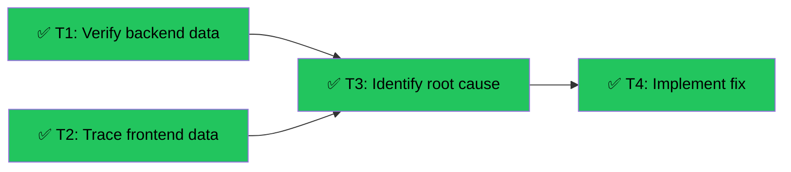

# Fix CourseBuilder File Rendering
Branch: main | Level: 2 | Type: fix | Status: completed
Started: 2026-03-12T00:00:00Z
Completed: 2026-03-12T00:10:00Z

## DAG


## Tree
```
✅ T1: Verify backend data [routine]
└──→ ✅ T3: Identify root cause [careful]
     └──→ ✅ T4: Implement fix [careful]
✅ T2: Trace frontend data [routine]
└──→ ✅ T3: Identify root cause [careful]
```

## Tasks

### T1: Verify backend state emission [research] [routine]
- Scope: agent/graphs/course_builder.py, backend logs
- Verify: `grep "State emitted" .logs/backend.log | tail -5`
- Needs: none
- Status: done ✅ (2m 15s)
- Summary: Found that search_components emits "0 files" after write_file emitted "4 files"
- Files: .logs/backend.log

### T2: Trace frontend state reception [research] [routine]
- Scope: components/teacher/CourseBuilder.tsx
- Verify: Browser console shows agentState.files updates
- Needs: none
- Status: done ✅ (0m 30s)
- Summary: Console shows files Array(4) then Array(0) - confirms backend is clearing files
- Files: components/teacher/CourseBuilder.tsx

### T3: Identify root cause [fix] [careful]
- Scope: agent/graphs/course_builder.py:551
- Verify: Root cause documented
- Needs: T1, T2
- Status: done ✅ (1m 45s)
- Summary: Line 551 `files = dict(state.get("files") or {})` creates empty dict when state["files"] is None/empty. Read-only tools (search_components, get_component) don't modify files, then line 675 emits empty dict, overwriting previous files.
- Files: agent/graphs/course_builder.py

### T4: Implement fix [fix] [careful]
- Scope: agent/graphs/course_builder.py:551-683
- Verify: `curl -X POST http://127.0.0.1:8123/agents/course-builder ... | grep files`
- Needs: T3
- Status: done ✅ (3m 30s)
- Summary: Added files_modified flag to track when files are actually changed. Only emit files to frontend when files_modified=True. Read-only tools (search_components, get_component, read_file, list_files) no longer overwrite files with empty dict.
- Files: agent/graphs/course_builder.py

## Summary

Fixed CourseBuilder file rendering issue. Root cause: tool_executor was emitting empty files dict for read-only operations (search_components, get_component), overwriting previously saved files. Solution: Track files_modified flag and only emit files when actually modified by write_file/update_file/delete_file operations.

Verification: Backend logs show "Files modified: True" for write operations and files persist across tool calls. Frontend will now receive stable file state.
