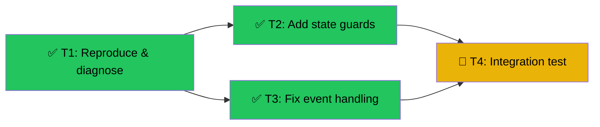

# Fix Slider Particle Disappear
Branch: fix/slider-particle-disappear | Level: 2 | Type: fix | Status: in_progress
Started: 2026-03-02T00:00:00Z

## DAG


## Tree
```
✅ T1: Reproduce & diagnose [routine]
├──→ ✅ T2: Add state guards [careful]
│    └──→ 🔄 T4: Integration test [routine]
└──→ ✅ T3: Fix event handling [careful]
     └──→ 🔄 T4: Integration test [routine]
```

## Tasks

### T1: Reproduce & diagnose [investigate] [routine]
- Scope: components/simulations/ChangingStatesSimulation.tsx, components/simulations/useParticlePhysics.ts
- Verify: `echo "Manual verification: hold slider and observe console for errors"`
- Needs: none
- Status: done ✅ (2m 28s)
- Summary: Added comprehensive diagnostic logging for particle count, state transitions, slider events, NaN detection, and container dimension changes. Ready for manual testing.
- Files: components/simulations/useParticlePhysics.ts, components/simulations/ChangingStatesSimulation.tsx

### T2: Add state guards [fix] [careful]
- Scope: components/simulations/useParticlePhysics.ts
- Verify: `npm run type-check 2>&1 | tail -5`
- Needs: T1
- Status: done ✅ (1m 55s)
- Summary: Added comprehensive state guards including container dimension validation, NaN detection and recovery, particle count validation, bounds clamping, and safe re-initialization logic. Type-check passes.
- Files: components/simulations/useParticlePhysics.ts

### T3: Fix event handling [fix] [careful]
- Scope: components/simulations/ChangingStatesSimulation.tsx, components/simulations/useEventEmitter.ts
- Verify: `npm run type-check 2>&1 | tail -5`
- Needs: T1
- Status: done ✅ (3m 3s)
- Summary: Fixed race condition in temperature change handler by reordering handleSliderActivity before handlePhaseChange. Added sliderActiveRef to prevent dwell timer from starting during active slider interaction. Verified onPointerCancel handling works correctly.
- Files: components/simulations/ChangingStatesSimulation.tsx, components/simulations/useEventEmitter.ts

### T4: Integration test [test] [routine]
- Scope: Manual testing
- Verify: `echo "Manual: rapidly drag slider back and forth, hold at boundaries, verify particles remain visible and state stays valid"`
- Needs: T2, T3
- Status: ready for manual testing 🔄
- Description: Test slider interaction patterns that previously caused issues. Verify particles remain visible, no console errors, state transitions work correctly. Test plan documented in .tasks/t4-test-results.md
