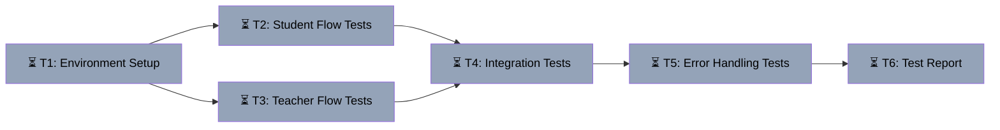

# Arch v3 E2E Testing Execution
Branch: main | Level: 3 | Type: implement | Status: in_progress
Started: 2026-03-07T14:50:00Z

## DAG


## Tree
```
⏳ T1: Environment Setup [routine]
├──→ ⏳ T2: Student Flow Tests [careful]
│    └──→ ⏳ T4: Integration Tests [careful]
├──→ ⏳ T3: Teacher Flow Tests [careful]
│    └──→ ⏳ T4: Integration Tests [careful]
└──→ ⏳ T5: Error Handling Tests [routine]
     └──→ ⏳ T6: Test Report [routine]
```

## Tasks

### T1: Environment Setup & Service Verification [implement] [routine]
- Scope: Backend startup, Letta service, database connection, environment variables
- Verify: `curl http://localhost:8123/health && curl http://localhost:8283/v1/health`
- Needs: none
- Status: pending ⏳
- Description: Start all required services (backend on :8123, Letta on :8283), verify Supabase connection, check environment variables

### T2: Student Flow Tests (T1.1-T1.3) [test] [careful]
- Scope: Student signup, session tracking, profile memory display
- Verify: `psql $DATABASE_URL -c "SELECT COUNT(*) FROM profiles WHERE role='student' AND letta_agent_id IS NOT NULL;"`
- Needs: T1
- Status: pending ⏳
- Description: Execute T1.1 (signup + agent creation), T1.2 (session tracking), T1.3 (profile memory display)

### T3: Teacher Flow Tests (T2.1-T2.4) [test] [careful]
- Scope: Teacher signup, course builder, dashboard
- Verify: `psql $DATABASE_URL -c "SELECT COUNT(*) FROM courses WHERE status='draft';"`
- Needs: T1
- Status: pending ⏳
- Description: Execute T2.1 (teacher signup), T2.2 (create lab simulation), T2.3 (iterate design), T2.4 (dashboard list)

### T4: Integration Tests (T3.1-T3.2) [test] [careful]
- Scope: Student using teacher-created courses, memory persistence
- Verify: `psql $DATABASE_URL -c "SELECT COUNT(*) FROM student_progress;"`
- Needs: T2, T3
- Status: pending ⏳
- Description: Execute T3.1 (student uses teacher course), T3.2 (memory persistence across sessions)

### T5: Error Handling Tests (T4.1-T4.4) [test] [routine]
- Scope: Graceful degradation, error handling
- Verify: `echo "Manual verification of error states"`
- Needs: T4
- Status: pending ⏳
- Description: Execute T4.1-T4.4 (signup without Letta, session without agent, profile without agent, course builder without Gemini)

### T6: Test Report & Documentation [implement] [routine]
- Scope: .tasks/arch-v3-test-results.md
- Verify: `test -f .tasks/arch-v3-test-results.md && wc -l .tasks/arch-v3-test-results.md`
- Needs: T5
- Status: pending ⏳
- Description: Compile test results, document failures, update arch-v3-testing.md with outcomes
