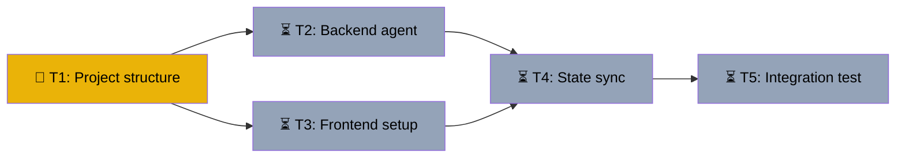

# CopilotKit + LangGraph Full-Stack Agent Scaffold
Branch: main | Level: 2 | Type: implement | Status: in_progress
Started: 2026-03-12T16:03:00Z

## DAG


## Tree
```
🔄 T1: Project structure & deps [routine]
├──→ ⏳ T2: Backend LangGraph agent [careful]
│    └──→ ⏳ T4: State sync integration [careful]
│         └──→ ⏳ T5: Integration test [routine]
└──→ ⏳ T3: Frontend CopilotKit setup [careful]
     └──→ ⏳ T4: State sync integration [careful]
          └──→ ⏳ T5: Integration test [routine]
```

## Tasks

### T1: Project structure & dependencies [implement] [routine]
- Scope: package.json, pyproject.toml, tsconfig.json, .env.example, README.md
- Verify: `npm install && cd backend && pip install -e . 2>&1 | tail -5`
- Needs: none
- Status: in_progress 🔄

### T2: Backend LangGraph agent [implement] [careful]
- Scope: backend/agent/, backend/server.py
- Verify: `cd backend && python -m pytest tests/test_agent.py -v 2>&1 | tail -5`
- Needs: T1
- Status: pending ⏳

### T3: Frontend CopilotKit setup [implement] [careful]
- Scope: src/app/, src/components/
- Verify: `npm run build 2>&1 | tail -5`
- Needs: T1
- Status: pending ⏳

### T4: State sync integration [implement] [careful]
- Scope: src/app/api/copilotkit/, backend/agent/state.py
- Verify: `npm run dev & sleep 5 && curl http://localhost:3000/api/copilotkit/health 2>&1 | tail -5`
- Needs: T2, T3
- Status: pending ⏳

### T5: Integration test [test] [routine]
- Scope: tests/
- Verify: `npm test 2>&1 | tail -5`
- Needs: T4
- Status: pending ⏳
