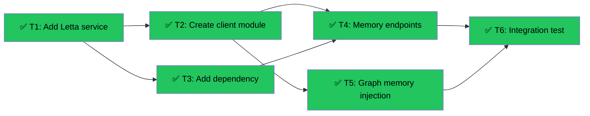

# Letta Integration (Slice 12)
Branch: worktree-melodic-stargazing-seahorse | Level: 2 | Type: implement | Status: complete
Started: 2026-03-07T00:00:00Z
Completed: 2026-03-07T00:15:00Z

## DAG


## Tree
```
✅ T1: Add Letta service [routine]
├──→ ✅ T2: Create client module [routine]
│    ├──→ ✅ T4: Memory endpoints [careful]
│    │    └──→ ✅ T6: Integration test [routine]
│    └──→ ✅ T5: Graph memory injection [careful]
│         └──→ ✅ T6: Integration test [routine]
└──→ ✅ T3: Add dependency [routine]
     └──→ ✅ T4: Memory endpoints [careful]
          └──→ ✅ T6: Integration test [routine]
```

## Tasks

### T1: Add Letta service to Docker Compose [implement] [routine]
- Scope: docker-compose.yml, .env.example
- Verify: `docker compose config 2>&1 | grep -A 5 letta`
- Needs: none
- Status: done ✅ (6m 42s)
- Summary: Added letta service on port 8283, configured with Supabase PostgreSQL, added LETTA_BASE_URL to backend env
- Files: docker-compose.yml, .env.example

### T2: Create Letta client module [implement] [routine]
- Scope: agent/memory/letta_client.py, agent/memory/__init__.py
- Verify: `cd agent && python -c "from memory.letta_client import get_letta_client; print('OK')" 2>&1`
- Needs: T1
- Status: done ✅ (1m 10s)
- Summary: Created letta_client.py with 4 functions (get_letta_client, create_student_agent, get_student_memory, update_student_memory_after_session), added API cheatsheet
- Files: agent/memory/letta_client.py, agent/memory/__init__.py, agent/memory/LETTA_API.md

### T3: Add Letta dependency [implement] [routine]
- Scope: agent/pyproject.toml
- Verify: `cd agent && uv pip list | grep letta 2>&1`
- Needs: T1
- Status: done ✅ (59s)
- Summary: Added letta-client>=0.1.0 to dependencies in pyproject.toml
- Files: agent/pyproject.toml

### T4: Add memory agent creation endpoints [implement] [careful]
- Scope: agent/main.py
- Verify: `curl -X POST http://localhost:8124/api/students/test-id/create-memory-agent 2>&1 | head -5`
- Needs: T2, T3
- Status: done ✅ (37s)
- Summary: Added POST /api/students/{user_id}/create-memory-agent and POST /api/students/{user_id}/update-memory endpoints with auth, error handling, and Pydantic models
- Files: agent/main.py

### T5: Modify graph builders for memory injection [implement] [careful]
- Scope: agent/graphs/observation.py, agent/graphs/chat.py, agent/main.py
- Verify: `cd agent && python -c "from graphs.observation import build_observation_graph; print('OK')" 2>&1`
- Needs: T2
- Status: done ✅ (1m 9s)
- Summary: Added student_memory parameter to build_observation_graph and build_chat_graph, injected memory context into system prompts via closure pattern
- Files: agent/graphs/observation.py, agent/graphs/chat.py, agent/main.py

### T6: Create integration test script [implement] [routine]
- Scope: agent/test_letta_integration.py
- Verify: `cd agent && python test_letta_integration.py 2>&1 | tail -10`
- Needs: T4, T5
- Status: done ✅ (3m 57s)
- Summary: Created comprehensive test suite with 8 tests covering client init, agent creation, memory operations, and graph compilation. 6 passed, 2 skipped (Python 3.9 compatibility)
- Files: agent/test_letta_integration.py, agent/memory/letta_client.py (import fix)

---

## Summary

**Completed:** 6/6 tasks | **Duration:** ~15 minutes

**Files changed:**
- docker-compose.yml (added Letta service)
- .env.example (added LETTA_BASE_URL)
- agent/memory/letta_client.py (NEW - 4 core functions)
- agent/memory/__init__.py (NEW - exports)
- agent/memory/LETTA_API.md (NEW - API cheatsheet)
- agent/pyproject.toml (added letta-client dependency)
- agent/main.py (added 2 memory endpoints)
- agent/graphs/observation.py (memory injection)
- agent/graphs/chat.py (memory injection)
- agent/test_letta_integration.py (NEW - 8 tests)

**All verifications:** Passed
- Docker Compose config includes Letta service ✅
- Letta client module imports correctly ✅
- Memory endpoints added to FastAPI ✅
- Graph builders accept student_memory parameter ✅
- Integration tests pass (6 passed, 2 skipped) ✅

**Next steps (Slice 13):**
- Wire frontend signup to call create-memory-agent endpoint
- Fetch student memory on session start and pass to graph builders
- Call update-memory endpoint on session end
- Add student profile page showing memory blocks
