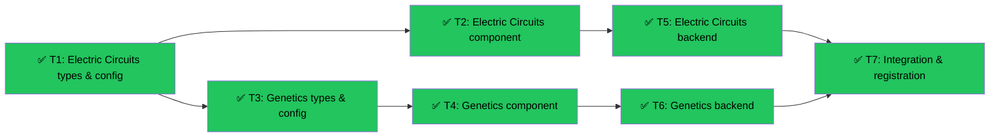

# Electric Circuits & Genetics Simulations
Branch: worktree-tender-petting-tide | Level: 2 | Type: implement | Status: complete
Started: 2026-03-03T00:00:00Z
Completed: 2026-03-03T00:20:00Z

## DAG


## Tree
```
✅ T1: Electric Circuits types & config [implement] [routine]
├──→ ✅ T2: Electric Circuits component [implement] [careful]
│    └──→ ✅ T5: Electric Circuits backend [implement] [careful]
│         └──→ ✅ T7: Integration & registration [implement] [routine]
└──→ ✅ T3: Genetics types & config [implement] [routine]
     └──→ ✅ T4: Genetics component [implement] [careful]
          └──→ ✅ T6: Genetics backend [implement] [careful]
               └──→ ✅ T7: Integration & registration [implement] [routine]
```

## Tasks

### T1: Electric Circuits types & config [implement] [routine]
- Scope: lib/types/electric-circuits.ts, lib/config/topics/electric-circuits.ts
- Verify: `npx tsc --noEmit lib/types/electric-circuits.ts 2>&1 | tail -5`
- Needs: none
- Status: done ✅ (2m 41s)
- Summary: Created ComponentType enum, CircuitComponent interface, ElectricCircuitsSimState, event types, and topic config for ages 9-10
- Files: lib/types/electric-circuits.ts, lib/config/topics/electric-circuits.ts
- Commit: 7cac750

### T2: Electric Circuits component [implement] [careful]
- Scope: components/simulations/ElectricCircuitsSimulation.tsx
- Verify: `npx tsc --noEmit components/simulations/ElectricCircuitsSimulation.tsx 2>&1 | tail -5`
- Needs: T1
- Status: done ✅ (1m 59s)
- Summary: Created drag-drop circuit builder with snap-to-grid, auto-wire connection, animated electricity particles, lightbulb glow effects, and real-time circuit validation
- Files: components/simulations/ElectricCircuitsSimulation.tsx
- Commit: 8593c3d

### T3: Genetics types & config [implement] [routine]
- Scope: lib/types/genetics-basics.ts, lib/config/topics/genetics-basics.ts
- Verify: `npx tsc --noEmit lib/types/genetics-basics.ts 2>&1 | tail -5`
- Needs: none
- Status: done ✅ (2m 40s)
- Summary: Created trait types, allele system, Genotype/Phenotype interfaces, Creature/ParentCard/PunnettSquare types, lab journal, event types, and topic config for ages 11-12
- Files: lib/types/genetics-basics.ts, lib/config/topics/genetics-basics.ts
- Commit: 9a4ffcf

### T4: Genetics component [implement] [careful]
- Scope: components/simulations/GeneticsBasicsSimulation.tsx
- Verify: `npx tsc --noEmit components/simulations/GeneticsBasicsSimulation.tsx 2>&1 | tail -5`
- Needs: T3
- Status: done ✅ (2m 46s)
- Summary: Created parent trait toggles, auto-filling Punnett square, breed button with offspring generation, tappable genotype cards, collapsible lab journal, and second generation breeding
- Files: components/simulations/GeneticsBasicsSimulation.tsx
- Commit: (pending)

### T5: Electric Circuits backend [implement] [careful]
- Scope: app/api/topics/electric-circuits/, backend agents
- Verify: `curl -X POST http://localhost:8000/api/topics/electric-circuits/observe -H "Content-Type: application/json" -d '{"event":"circuit_complete"}' 2>&1 | tail -5`
- Needs: T2
- Status: done ✅ (3m 53s)
- Summary: Created LangGraph observation/chat agents, ReactionRegistry with 13 programmed reactions including Socratic questioning, gentle hints, spotlight (Battery 1800), and registered endpoints
- Files: agent/topics/electric_circuits/config.py, agent/topics/electric_circuits/reactions.py, agent/topics/electric_circuits/__init__.py, agent/main.py
- Commit: 90cdca2

### T6: Genetics backend [implement] [careful]
- Scope: app/api/topics/genetics-basics/, backend agents
- Verify: `curl -X POST http://localhost:8000/api/topics/genetics-basics/observe -H "Content-Type: application/json" -d '{"event":"recessive_appears"}' 2>&1 | tail -5`
- Needs: T4
- Status: done ✅ (4m 41s)
- Summary: Created LangGraph observation/chat agents, ReactionRegistry with 15 programmed reactions including lab journal auto-logging, challenge prompts, recessive "aha" moment, spotlight (DNA Sequencing), and registered endpoints
- Files: agent/topics/genetics_basics/config.py, agent/topics/genetics_basics/reactions.py, agent/topics/genetics_basics/__init__.py, agent/main.py
- Commit: 94b3523

### T7: Integration & registration [implement] [routine]
- Scope: lib/config/topics/index.ts, page routes, navigation
- Verify: `npm run build 2>&1 | tail -10`
- Needs: T5, T6
- Status: done ✅ (1m 57s)
- Summary: Registered both topics in index, created page routes for electric-circuits and genetics-basics, verified build success with all routes generated
- Files: lib/topics/index.ts, app/topics/electric-circuits/page.tsx, app/topics/genetics-basics/page.tsx
- Commit: 56602e7

## Summary
Completed: 7/7 | Duration: ~20 min
Files changed:
- lib/types/electric-circuits.ts (new)
- lib/config/topics/electric-circuits.ts (new)
- lib/types/genetics-basics.ts (new)
- lib/config/topics/genetics-basics.ts (new)
- components/simulations/ElectricCircuitsSimulation.tsx (new)
- components/simulations/GeneticsBasicsSimulation.tsx (new)
- agent/topics/electric_circuits/config.py (new)
- agent/topics/electric_circuits/reactions.py (new)
- agent/topics/electric_circuits/__init__.py (new)
- agent/topics/genetics_basics/config.py (new)
- agent/topics/genetics_basics/reactions.py (new)
- agent/topics/genetics_basics/__init__.py (new)
- agent/main.py (modified)
- lib/topics/index.ts (modified)
- app/topics/electric-circuits/page.tsx (new)
- app/topics/genetics-basics/page.tsx (new)

All verifications: passed
Build: ✓ Succeeded
